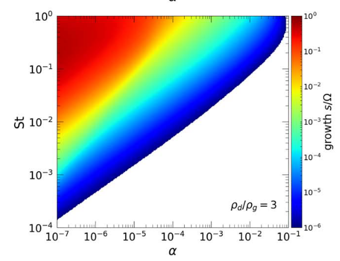

The streaming instability, a key mechanism for planetesimal formation, is highly sensitive to turbulence in protoplanetary disks. Our linear theory analysis shows that turbulence suppresses instability growth, especially for small particles, with significant growth only possible beyond tens of astronomical units in weakly turbulent disks. This suggests that in typical, turbulent protoplanetary environments, the streaming instability may struggle to form planetesimals, particularly for smaller particles.

Figure: Growth rate of the streaming instability as a function of alpha viscosity and Stokes number for a dust-to-gas ratio of 3.
