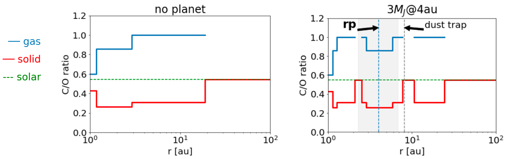

My recent research demonstrated that gap-opening planets alter disk temperatures, influencing the chemical environment available for planet formation. We developed a novel iterative model integrating hydrodynamic and radiative transfer simulations to assess the impact of giant planets on disk temperature and C/O ratio. Unlike conventional models, our iterative approach reveals substantial variations in gap width, depth, and temperature distribution. Specifically, We found that the iterative method predicts a wider, deeper gap and distinct shifts in midplane temperatures, iceline locations, and volatile distributions. These changes suggest a more complex impact of disk-planet interactions on planetary atmosphere compositions than previously understood and challenge the canonical picture of the non-planet
disk C/O ratio.

Figure: The Carbon-to-Oxygen (C/O) ratio as a function of disk radius, calculated from our iterative model with a gap opened by a giant planet, compared to that in a disk without a planet.