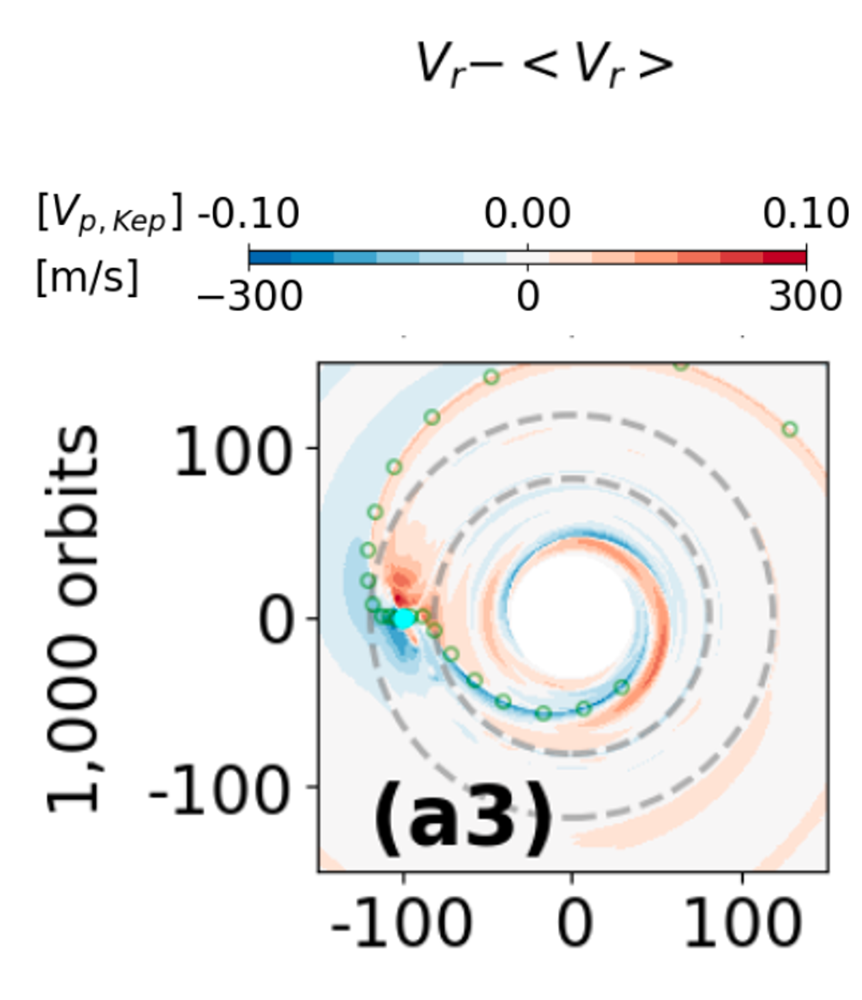

A new paper following up our previous paper Chen et.al 2024. In this paper, we implement multiple dust species into the iterative method. We find the midplane iceline locations are not siginificantly change from our previous gas-only models. We also explore the affects of different turbulent viscosities on the disk thermal structure.

<!-- 

Figure: The non-axisymmetric radial velocity perturbation at 2 disk scale height caused by a Jovian planet in a disk. -->
